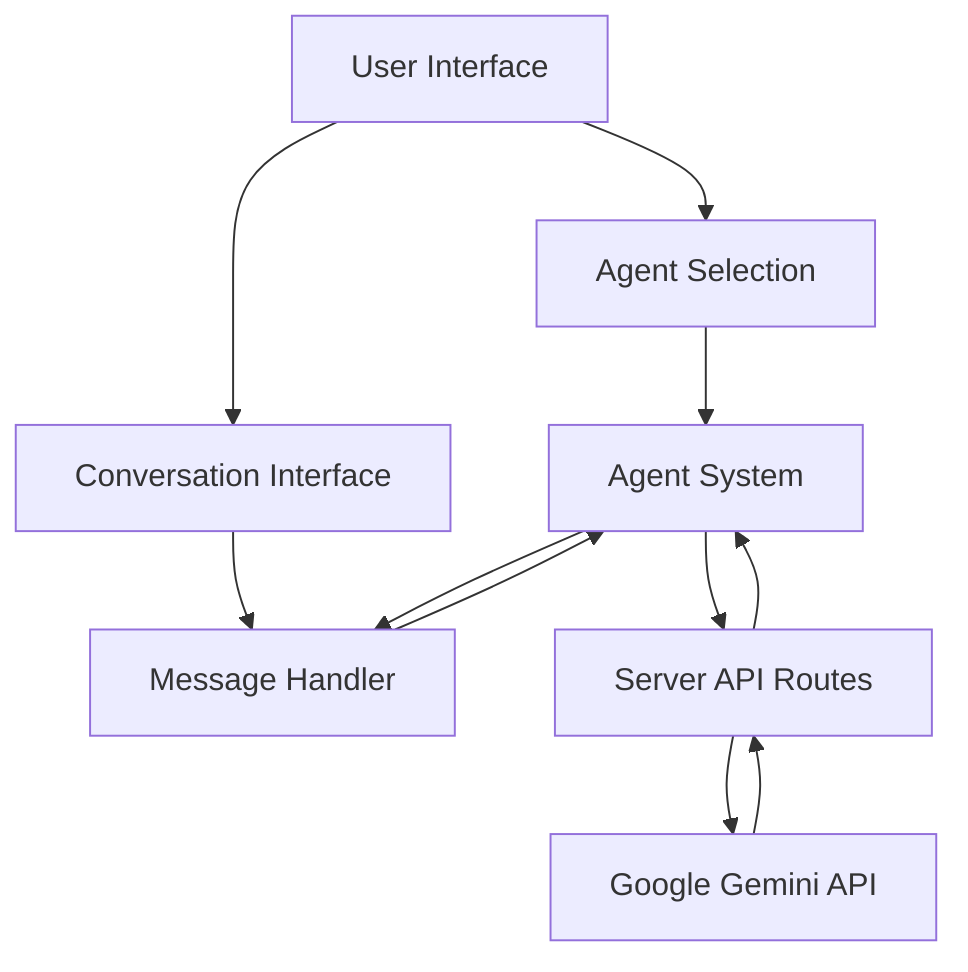

# System Patterns

## Architecture Overview

The Retro AI Agent Assistant is built on a Nuxt.js framework with a client-server architecture. The frontend handles UI rendering and user interactions, while server-side API routes communicate with the Google Gemini API for AI responses.



## Core Components

1. **Agent System**: Manages different AI agent personalities and their specialized knowledge
2. **Conversation Interface**: Handles user messages and displays AI responses
3. **Server API Integration**: Communicates with the Gemini API and processes responses

## Key Design Patterns

### 1. Agent Pattern

The system uses an agent-based approach where each agent has:

- A specialized knowledge domain
- Personality traits
- System instructions
- Training examples

This pattern allows for easy extension with new agent types while maintaining consistent interface.

### 2. Streaming Response Pattern

Responses from the AI are streamed to the user in real-time:

1. User sends a message
2. Request is sent to the API
3. Responses are streamed back as they're generated
4. UI updates incrementally as chunks arrive

### 3. Component-Based UI

The UI is built using Vue components with clear separation of concerns:

- `ChatWidget`: Main container for the chat interface
- `ChatBox`: Handles message display and input
- Nested components for specific UI elements

### 4. State Management

The application uses Vue's reactive state management to handle:

- User and AI messages
- Currently selected agent
- Streaming message state
- Typing indicators

## File Structure Patterns

```
agents/                 # Agent definitions and system prompts
  ├── index.ts          # Agent type definitions and utilities
  ├── frontendDeveloperAgent.ts
  ├── backendDeveloperAgent.ts
  └── productManagerAgent.ts

components/             # UI components
  ├── ChatWidget/       # Main chat interface components
  └── ... (other UI components)

pages/                  # Application pages/routes
  └── index.vue         # Main application page

server/                 # Server-side code
  └── api/              # API routes for AI communication
     └── ai.ts          # Gemini API integration
```

## Extension Patterns

The system is designed for extensibility in the following ways:

1. **Adding new agents**: Create a new agent file in the `agents` directory and register it in `agents/index.ts`
2. **Extending UI**: Add new components or modify existing ones in the `components` directory
3. **Adding features**: Implement new functionality by extending the core components and server API
