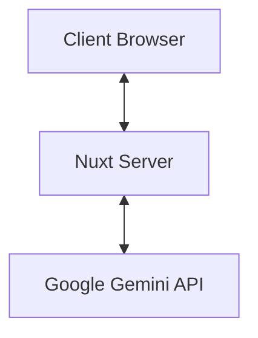
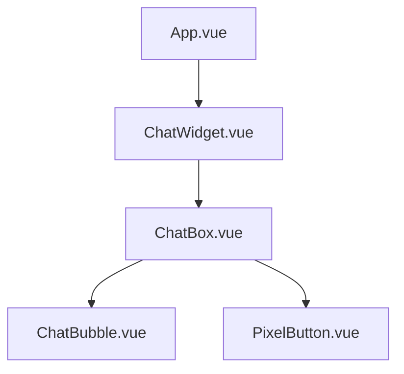
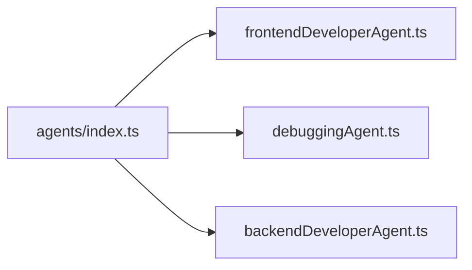
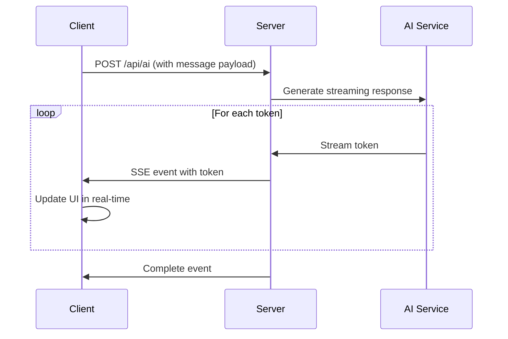
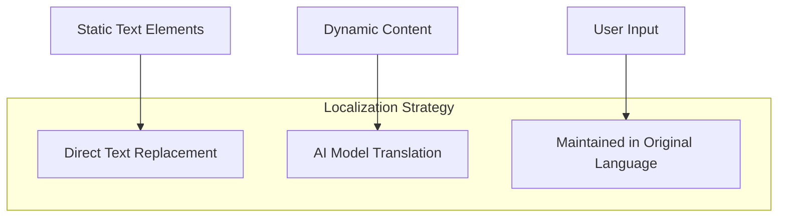
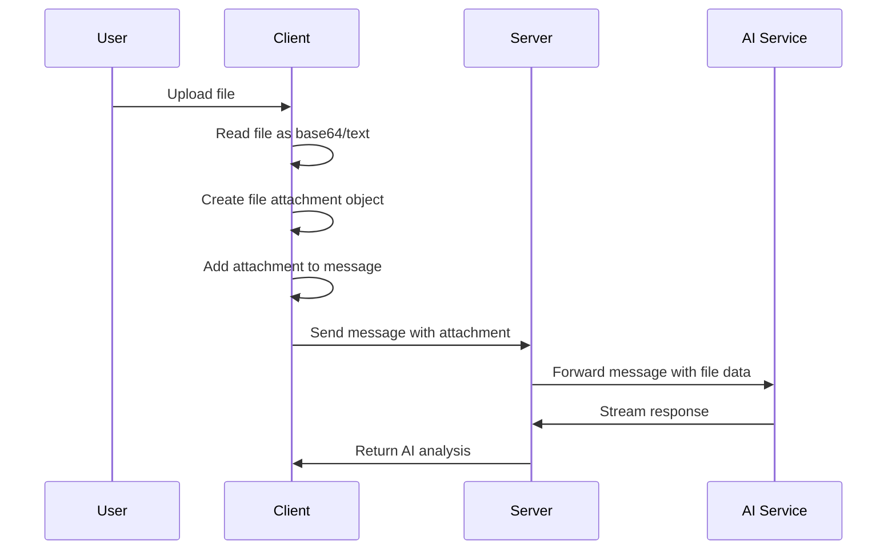

# System Patterns

## Overall Architecture

The application follows a client-server architecture using Nuxt.js as the framework. The frontend is built with Vue 3 and TypeScript, with TailwindCSS for styling. The backend is a minimal Nuxt API server that handles communication with external AI services.



## Component Architecture

The application follows a component-based architecture with Vue 3 Composition API.



- **App.vue**: Main application container
- **ChatWidget.vue**: Manages chat state and API communication
- **ChatBox.vue**: UI container for messages and input
- **ChatBubble.vue**: Individual message display
- **PixelButton.vue**: Reusable button component with pixel styling

## Agent System

The application uses a flexible agent system that allows for different AI personalities and specializations.



Agents are defined with customizable system prompts and can be selected at runtime, allowing the application to serve different use cases with the same core functionality.

## API Communication Pattern

The application uses a streaming Server-Sent Events (SSE) pattern for real-time updates.



This pattern provides a responsive user experience with immediate feedback as the AI generates its response.

## Localization Pattern

The application employs a direct text replacement localization pattern for Vietnamese language support.



Key aspects of the localization pattern:

1. Static UI elements are directly replaced with Vietnamese equivalents
2. User interface is designed to accommodate longer Vietnamese text
3. Character styling and naming follows Vietnamese cultural patterns
4. Future implementation will use a more structured i18n approach

## File Handling Pattern

The application uses a client-side file processing pattern that minimizes server load.



File processing flow:

1. Files are selected through a file input element
2. Files are read client-side using FileReader API
3. Images are encoded as base64, text files are read as text
4. File metadata and content are attached to the message
5. The server formats the message+attachments for the AI service
6. The AI processes both the text and file content together

## State Management

The application uses Vue's Composition API for state management, with reactive references and computed properties.

```javascript
// Chat state
const messages = ref<Message[]>([])
const streamingMessage = ref<Message | null>(null)
const usersTyping = ref<User[]>([])
```

This pattern keeps state encapsulated within components while allowing for reactivity and derived state.

## Error Handling

The application uses a multi-layered error handling approach:

1. Client-side validation for user input
2. Try-catch blocks for asynchronous operations
3. Fallback UI for failed operations
4. Error states in the streaming response

```typescript
try {
  // API call
} catch (error) {
  if (streamingMessage.value) {
    streamingMessage.value.text = 'Error: Failed to connect to the AI service.'
  }
}
```

## Styling Pattern

The application uses a consistent retro pixel art styling achieved through:

1. TailwindCSS for layout and basic styling
2. Custom CSS for pixel art effects
3. Consistent border and shadow treatments
4. Image rendering with pixelated quality

```css
.pixel-border {
  border-style: solid;
  border-width: 4px;
  position: relative;
}

.pixelated {
  image-rendering: pixelated;
}
```

This styling is applied consistently across all components to maintain the retro aesthetic, with adaptations to accommodate Vietnamese text where needed.
