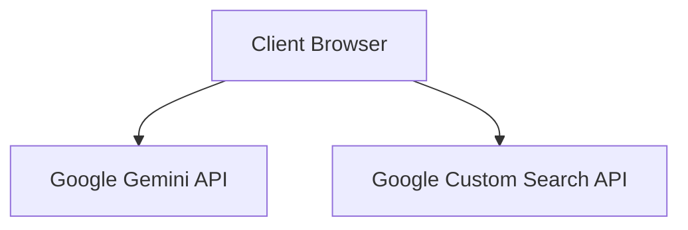
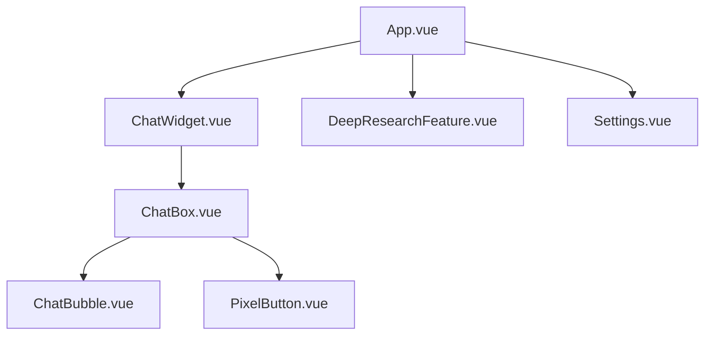
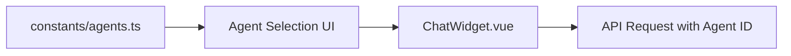
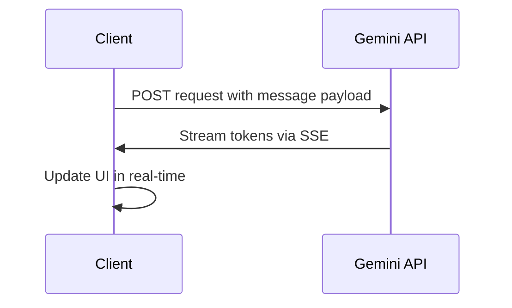
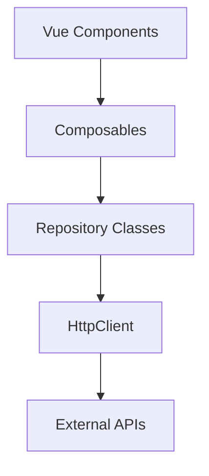
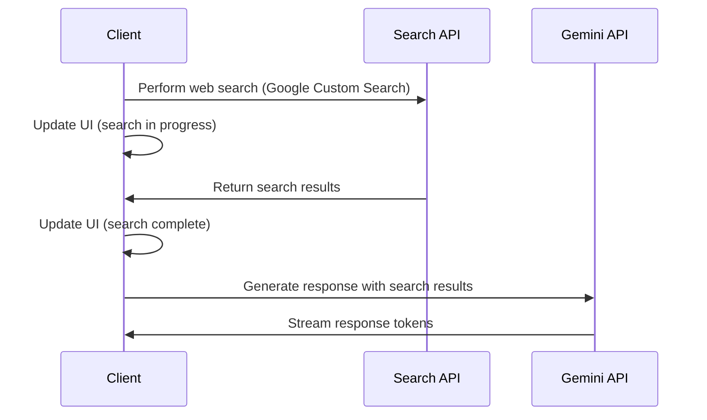
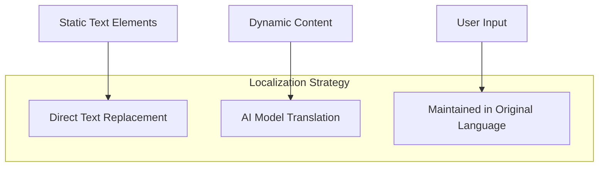
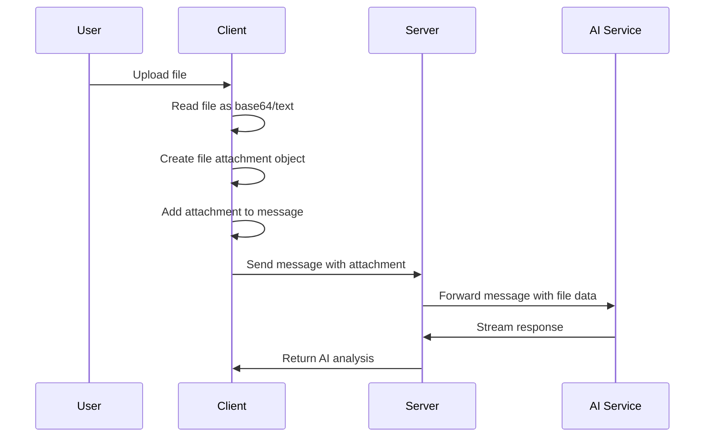

# System Patterns

## Overall Architecture

The application follows a client-side architecture using Nuxt.js as the framework. The frontend is built with Vue 3 and TypeScript, with TailwindCSS for styling. The application directly communicates with external API services without a server intermediary.



## Component Architecture

The application follows a component-based architecture with Vue 3 Composition API.



- **App.vue**: Main application container
- **ChatWidget.vue**: Manages chat state and API communication
- **ChatBox.vue**: UI container for messages and input
- **ChatBubble.vue**: Individual message display
- **PixelButton.vue**: Reusable button component with pixel styling
- **DeepResearchFeature.vue**: Promotional component for Deep Research capability
- **Settings.vue**: Interface for managing API keys and preferences

## Agent System

The application uses an agent selection system that allows for different AI personalities and specializations. Agent definitions are stored in the constants/agents.ts file.



Each agent has a unique ID, name, and description, which are used to customize the UI and prompt sent to the AI service.

## API Communication Pattern

The application uses a streaming Server-Sent Events (SSE) pattern for real-time updates directly from the external API services.



This pattern provides a responsive user experience with immediate feedback as the AI generates its response.

## Repository Pattern for API Services

The application implements the Repository pattern for organizing API services and ensuring separation of concerns:



Key characteristics of this pattern:

1. **Service Interfaces**: Each service implements either `Repository<T, R>` or `StreamingRepository<T, R>` interfaces
2. **Request/Response Types**: Each service has clearly defined request and response interfaces in `types/api.ts`
3. **HttpClient**: A central client for making HTTP requests, handling common concerns like base URL and error handling
4. **Composables**: Vue composables that wrap repositories with reactive state for easy component integration
5. **Factory Functions**: Helper functions for creating repository instances

Benefits:

- Improved code organization and maintainability
- Clear separation of concerns between data access and UI logic
- Consistent error handling across API calls
- Typed request and response objects for better type safety
- Easier testing through abstraction layers

## Web Search Pattern

For the Deep Research feature, the application implements a web search pattern that enriches AI responses with real-time information.



Key characteristics of this pattern:

1. Web search is performed directly via Google Custom Search API
2. Search progress is shown in the client UI in real-time
3. Search results are formatted and added to the AI prompt
4. The entire process maintains the streaming nature of the application
5. Status messages provide transparency during the search process
6. API keys are managed securely in client-side storage

## Localization Pattern

The application employs a direct text replacement localization pattern for Vietnamese language support.



Key aspects of the localization pattern:

1. Static UI elements are directly replaced with Vietnamese equivalents
2. User interface is designed to accommodate longer Vietnamese text
3. Character styling and naming follows Vietnamese cultural patterns
4. Future implementation will use a more structured i18n approach

## File Handling Pattern

The application uses a client-side file processing pattern that minimizes server load.



File processing flow:

1. Files are selected through a file input element
2. Files are read client-side using FileReader API
3. Images are encoded as base64, text files are read as text
4. File metadata and content are attached to the message
5. The server formats the message+attachments for the AI service
6. The AI processes both the text and file content together

## State Management

The application uses Vue's Composition API for state management, with reactive references and computed properties.

```javascript
// Chat state
const messages = ref<Message[]>([])
const streamingMessage = ref<Message | null>(null)
const usersTyping = ref<User[]>([])
```

This pattern keeps state encapsulated within components while allowing for reactivity and derived state.

## Error Handling

The application uses a multi-layered error handling approach:

1. Client-side validation for user input
2. Try-catch blocks for asynchronous operations
3. Fallback UI for failed operations
4. Error states in the streaming response

```typescript
try {
  // API call
} catch (error) {
  if (streamingMessage.value) {
    streamingMessage.value.text = 'Error: Failed to connect to the AI service.'
  }
}
```

## Styling Pattern

The application uses a consistent retro pixel art styling achieved through:

1. TailwindCSS for layout and basic styling
2. Custom CSS for pixel art effects
3. Consistent border and shadow treatments
4. Image rendering with pixelated quality

```css
.pixel-border {
  border-style: solid;
  border-width: 4px;
  position: relative;
}

.pixelated {
  image-rendering: pixelated;
}
```

This styling is applied consistently across all components to maintain the retro aesthetic, with adaptations to accommodate Vietnamese text where needed.
